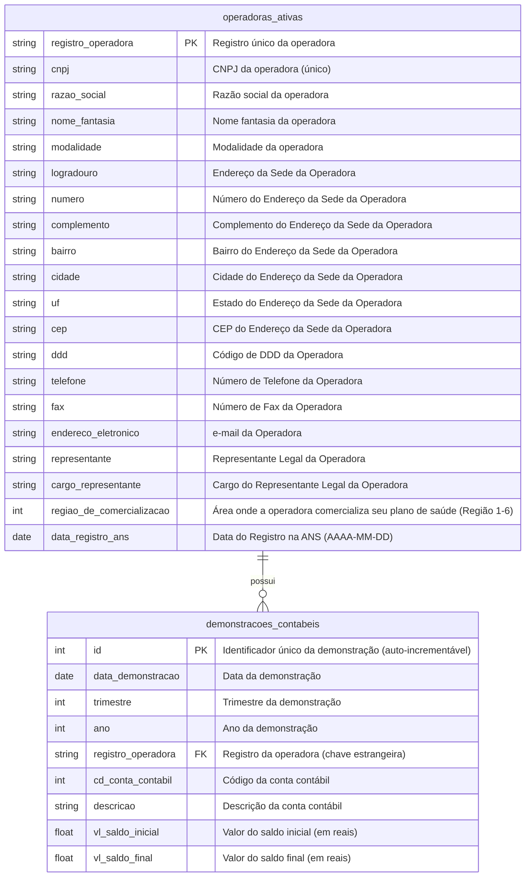

# **Etapa de Geração do Banco de Dados**

Este projeto realiza a coleta, tratamento e inserção de dados em um banco PostgreSQL a partir de arquivos CSV. Ele gera scripts SQL para criação de tabelas e inserção de dados, com suporte a execução via Docker ou script Python.

---
## **Resumo do Projeto**

### **Objetivo**
- Criar um banco de dados relacional para armazenar e analisar dados de operadoras de saúde.
- Gerar scripts SQL otimizados para inserção de dados.
- Responder a perguntas analíticas específicas utilizando queries SQL.

### **Destaques**
- **Modelagem de Dados:** Baseada no dicionário de dados da ANS.
- **Otimização de Performance:** Uso de paralelismo, threading e concorrência para geração de scripts SQL.
- **Flexibilidade:** Suporte a dois modos de inserção: **bulk load** (carregamento em massa) e **query simples**.
- **Análise de Dados:** Queries analíticas para identificar operadoras com maiores despesas em categorias específicas.

---

## **Etapas do Projeto**

### **1. Coleta dos Dados**
Os dados foram coletados a partir de arquivos CSV fornecidos e organizados em pastas específicas para facilitar o acesso e manipulação.

---

### **2. Modelagem dos Dados**
A modelagem foi feita com base no dicionário de dados da ANS. O diagrama abaixo representa as tabelas e seus relacionamentos:



---

### **3. Tratamento dos Dados**
Os dados foram tratados utilizando a biblioteca **Polars**:
- **Renomeação de colunas:** Exemplo: `registro_ans` → `registro_operadora`.
- **Conversão de tipos:** Datas no formato `DD/MM/AAAA` foram convertidas para `AAAA-MM-DD`.
- **Formatação de textos:** Padronização de descrições e remoção de espaços desnecessários.
- **Verificação de integridade:** Remoção de registros com operadoras inativas.

---

### **4. Geração dos Scripts SQL**

Foram gerados dois tipos de scripts para inserção de dados no banco de dados:

1. **Query Simples:** Inserções padrão em blocos menores, ideais para ambientes locais ou com menor volume de dados.
2. **Bulk Load:** Arquivos CSV comprimidos e scripts otimizados para carregamento em massa, utilizando ferramentas na nuvem para facilitar o processo.

#### **Uso do Firebase Storage**
No modo **bulk load**, os arquivos CSV gerados são comprimidos utilizando o algoritmo **LZ4** e enviados automaticamente para o **Firebase Storage**. Essa abordagem permite:
- **Armazenamento na nuvem:** Os arquivos são enviados para um bucket do Firebase Storage, garantindo acessibilidade e escalabilidade.
- **Execução otimizada:** Os comandos SQL gerados utilizam o recurso `COPY FROM PROGRAM` do PostgreSQL, combinado com `curl` e `lz4`, para baixar e descomprimir os arquivos diretamente do Firebase Storage, reduzindo o tempo de carregamento.

#### **Otimização de Performance**
- **Paralelismo e Threading:** Uso de `ThreadPoolExecutor` para processar os dados em chunks paralelamente, aproveitando múltiplos núcleos da CPU.
- **Concorrência:** Divisão de grandes volumes de dados em partes menores para reduzir o tempo de execução e melhorar a eficiência.
- **Compressão LZ4:** Redução do tamanho dos arquivos CSV para acelerar o upload e o carregamento no banco.

#### **Exemplo de Fluxo no Modo Bulk Load**
1. Os dados são processados e divididos em chunks.
2. Cada chunk é salvo localmente como um arquivo CSV comprimido.
3. Os arquivos comprimidos são enviados para o Firebase Storage.
4. Comandos SQL são gerados para carregar os dados diretamente do Firebase Storage para o PostgreSQL.

---

## **Execução dos Scripts**

### **1. Instalação de Dependências**
Instale as dependências com:
```bash
pip install -r requirements.txt
```

### **2. Geração dos Scripts SQL**
Execute o script `gerador_de_sql.py` com os argumentos abaixo:

| **Argumento**         | **Descrição**                          | **Valores Aceitos**                                                                 |
|------------------------|---------------------------------------|------------------------------------------------------------------------------------|
| `-mg`, `--modo_de_geracao` | Define o modo de geração do SQL.  | `'bulk_load'` ou `'sem_bulk_load'` (padrão).                                       |
| `-mu`, `--modo_de_utilizacao` | Define o tipo de utilização do script. | `'vizualizacao'` (padrão) ou `'docker'`.                                           |

#### **Exemplos de Uso**
- Geração com bulk load:
  ```bash
  python gerador_de_sql.py -mg bulk_load -mu docker
  ```
- Geração sem bulk load:
  ```bash
  python gerador_de_sql.py -mg sem_bulk_load -mu vizualizacao
  ```

### **3. Inserção no Banco**
#### **Opção 1: Utilizando Docker**
1. Certifique-se de que os scripts SQL estão no diretório `database/scripts`.
2. Suba o container:
   ```bash
   docker-compose up --build
   ```

#### **Opção 2: Utilizando o Script de Inserção**
1. Certifique-se de que o banco está em execução.
2. Execute o script:
   ```bash
   python inserir_scripts_sql_no_banco.py --host localhost --database testetec-ic --user admin --password senhasegura --port 5432
   ```

---

## **5. Query Analítica**

### **Objetivo**
Responder às perguntas:
1. Quais as 10 operadoras com maiores despesas em **"EVENTOS/SINISTROS CONHECIDOS OU AVISADOS DE ASSISTÊNCIA A SAÚDE MÉDICO HOSPITALAR"** no último trimestre?
2. Quais as 10 operadoras com maiores despesas nessa categoria no último ano?

### **Solução**
Foram criadas duas funções auxiliares em PL/pgSQL e duas queries analíticas.

#### **Funções Auxiliares**
- **`obter_trimestre_anterior`:** Retorna o trimestre e o ano correspondentes ao último trimestre.
- **`obter_ano_anterior`:** Retorna o ano anterior.

#### **Queries**
- **Último Trimestre:**
  ```sql
  SELECT sum(dc.vl_saldo_final) as total_de_despesa, oi.*
  FROM operadoras_ativas oi 
  JOIN demonstracoes_contabeis dc 
      ON oi.registro_operadora = dc.registro_operadora
  WHERE 
      unaccent(dc.descricao) ILIKE unaccent('%EVENTOS/SINISTROS CONHECIDOS OU AVISADOS DE ASSISTÊNCIA A SAÚDE MÉDICO HOSPITALAR%')
      AND dc.vl_saldo_final < 0
      AND dc.trimestre = (SELECT trimestre FROM obter_trimestre_anterior())
      AND dc.ano = (SELECT ano FROM obter_trimestre_anterior())
  GROUP BY oi.registro_operadora, dc.vl_saldo_final
  ORDER BY dc.vl_saldo_final
  LIMIT 10;
  ```

- **Último Ano:**
  ```sql
  SELECT sum(dc.vl_saldo_final) as total_de_despesa, oi.*
  FROM operadoras_ativas oi 
  JOIN demonstracoes_contabeis dc 
      ON oi.registro_operadora = dc.registro_operadora
  WHERE 
      unaccent(dc.descricao) ILIKE unaccent('%EVENTOS/SINISTROS CONHECIDOS OU AVISADOS DE ASSISTÊNCIA A SAÚDE MÉDICO HOSPITALAR%')
      AND dc.vl_saldo_final < 0
      AND dc.ano = (SELECT ano FROM obter_trimestre_anterior())
  GROUP BY oi.registro_operadora, dc.vl_saldo_final
  ORDER BY dc.vl_saldo_final
  LIMIT 10;
  ```

---

## **Estrutura do Projeto**
```
TesteTec-IC/
├── arquivos/
│   ├── dados_cadastrais/
│   ├── demonstracoes_contabeis/
├── database/
│   ├── Dockerfile
│   └── scripts/
└── docker-compose.yml
├── gerador_de_sql.py
├── inserir_scripts_sql_no_banco.py
├── tabelas.sql
├── queries_analiticas.sql
├── README.md
├── credenciais_firebase.json
└── requirements.txt
```

---

## **Destaques Técnicos**
- **Otimização:** Uso de paralelismo, threading e concorrência para geração de scripts SQL.
- **Flexibilidade:** Suporte a diferentes modos de inserção (bulk load e query simples).
- **Programação na Nuvem:** Integração com o Firebase Storage para upload e gerenciamento de arquivos comprimidos, otimizando o carregamento de dados no banco.
- **Análise de Dados:** Queries analíticas para responder perguntas específicas.

---